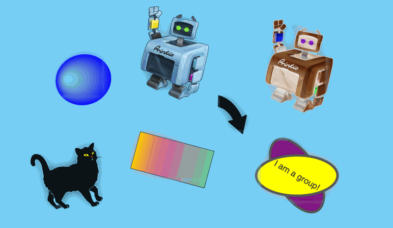

# Make It Lively

Upload a static image, watch an agent identify its foreground elements,
extract each one as a layer, redraw them on a canvas, and bring them to life
with natural-language prompts. M1 MVP: Vite + Vue 3 frontend, FastAPI
backend, Claude VLM + (optionally) Replicate SAM2 / SD-inpainting, GSAP
animations, and GIF export.

```
Upload → Perception (VLM) → Segment → Inpaint → Animate → Export MP4 / GIF
```

## Demo

### GIF



### Video (MP4)

<video src="assets/make-it-lively_video.mp4" controls width="600">
  Your browser does not support the video tag. <a href="assets/make-it-lively_video.mp4">Download MP4</a>
</video>

## Repository layout

```
backend/      FastAPI + Claude + Replicate (or Pillow fallbacks)
frontend/     Vite + Vue 3 + GSAP + gifenc
scripts/      Ralph autonomous-iteration loop configs and state
tasks/        Planning docs (PRDs)
```

## Prerequisites

- Node 20+ and npm (for the frontend)
- Python 3.11+ and [uv](https://github.com/astral-sh/uv) (for the backend)
- An Anthropic key (via `ANTHROPIC_API_KEY` or `ANTHROPIC_AUTH_TOKEN`)
- *Optional:* a Replicate API token. Without it the backend auto-switches to
  local Pillow fallbacks for segmentation and inpainting — quality is lower
  but the full pipeline still runs end-to-end.

## Quick start

```bash
# 1. Install both halves
make install

# 2. Fill in your keys
cp backend/.env.example backend/.env
$EDITOR backend/.env     # set ANTHROPIC_* (and REPLICATE_API_TOKEN or USE_REPLICATE_FALLBACK=true)

# 3. Start backend + frontend together
make dev                 # backend on :8000, frontend on :5173

# Open http://localhost:5173 and drop an image in.
```

Other Make targets:

```bash
make test       # backend pytest + frontend vitest
make lint       # ruff + mypy + vue-tsc
make clean      # remove generated storage and caches
```

## Documentation

- [`backend/README.md`](backend/README.md) — FastAPI app, endpoints, env vars, fallback mode
- [`frontend/README.md`](frontend/README.md) — Vite app, routes, build
- [`tasks/prd-make-it-lively.md`](tasks/prd-make-it-lively.md) — Full product spec

## Development with Ralph

This project was built by running
[Ralph](https://github.com/snarktank/ralph) autonomously one user story at a
time. The loop config, PRD JSON, and progress log live in `scripts/ralph/`.
To continue iterating:

```bash
./scripts/ralph/ralph.sh --tool claude 3
```

## Known limits (M1 scope)

- **Granularity**: elements are whole objects, not sub-parts. "Wave the
  robot's hand" will rotate the entire robot — see PRD Open Questions for
  the planned M1.5 fix (sub-part perception + `transform-origin` DSL).
- **Fallback segmentation** produces rectangular silhouettes. Set
  `REPLICATE_API_TOKEN` to get SAM2's pixel-accurate cuts.
- **Browser e2e** is manual. The UI tests in `frontend/` cover components
  only; end-to-end verification is documented in
  [`backend/tests/e2e/smoke.md`](backend/tests/e2e/smoke.md).
